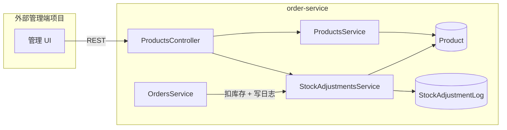

# 商品管理模块 — 技术设计

> 状态：planning · 随 PRD 同步更新

## 架构示意



## 数据模型

### Product（扩展）
```typescript
enum ProductStatus {
  DRAFT = 'draft',
  ACTIVE = 'active',
  INACTIVE = 'inactive',
}
```

### StockAdjustmentLog（新建）
- 表名建议：`stock_adjustment_logs`
- 索引：`productId`, `createdAt`

## 接口契约摘要

| 方法 | 路径 | 说明 |
|------|------|------|
| GET | `/products` | + `status`, `minStock`, `maxStock`, `includeDeleted` |
| DELETE | `/products/:id` | 软删除（`deletedAt`） |
| POST | `/products/:id/restore` | P1：恢复 |
| POST | `/products/import` | CSV 上传，行级部分成功；`?dryRun=true` |
| PATCH | `/products/batch-status` | 批量改 status |
| POST | `/products/:id/stock-adjustments` | 手工调库存 |
| GET | `/products/:id/stock-adjustments` | 日志分页 |

## 实现计划（分 PR）

### PR1 — 模型与基础增强
- `Product` 增加 `status`, `description`, `updatedAt`, `deletedAt`
- 软删除：改造 `remove` / 查询默认过滤 / `includeDeleted`
- 更新 Create/Update/Query DTO
- 列表筛选（status、库存区间）
- DB schema 同步说明

### PR2 — 库存调整日志
- `StockAdjustmentLog` 实体 + module 内 service
- POST/GET stock-adjustments
- `OrdersService.create` 同事务写 `reason=order` 日志

### PR3 — 运营批处理
- `POST /products/import`：`FileInterceptor` + `csv-parse`，行级错误聚合
- 提供示例 CSV：`docs/samples/products-import.sample.csv`
- `PATCH /products/batch-status`
- `inactive` 与已软删商品禁下单校验
- `POST /products/:id/restore`

### PR4 — 文档与质量
- Swagger 注解补全
- `docs/practice/05-20-product-management.md`
- lint / typecheck；可选 1–2 个 service 单测

## 实践步骤（大纲）

1. 启动 MySQL + `order-service`，打开 Swagger `/api`
2. 单条创建商品（含 status、description）
3. 列表筛选：`status=active&minStock=10`
4. `curl -F file=@sample.csv` 导入（含 1 行非法，验证 `errors[].row`）
4b. `?dryRun=true` 再导一次，确认库内条数不变
5. 手工 `stock-adjustments` + 查询日志
6. 下架商品 → 尝试下单 → 预期 4xx
7. 正常下单 → 查日志含 `reason=order`

## 文档交付物

| 文档 | 路径 |
|------|------|
| PRD | `.trellis/tasks/05-20-product-management/prd.md` |
| 本设计 | `info.md` |
| 实践步骤 | `docs/practice/05-20-product-management.md`（PR4） |
| Spec 更新 | `.trellis/spec/backend/*.md`（实现后） |
