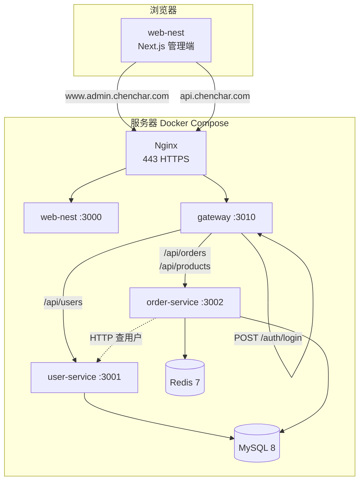

# my-firstnest — 全栈管理后台（后端）

NestJS Monorepo 微服务后端，与前端 [`web-nest`](../web-nest) 配套组成完整全栈方案：**API 网关统一入口 + 用户域/订单域分库 + Docker 一键部署**。

| 环境 | 地址 |
|------|------|
| API 网关（生产） | https://api.chenchar.com |
| 管理端（生产） | https://www.admin.chenchar.com |
| 网关（本地） | http://localhost:3010 |

---

## 项目是什么？

这是一套**可部署的生产级全栈后台系统**的后端部分，负责：

- 用户认证（JWT 登录）
- 用户管理（user-service）
- 商品、订单、库存、异步通知（order-service）
- 统一网关路由、限流、熔断与响应格式

前端界面、路由守卫与页面交互由 [`web-nest`](../web-nest) 实现；本仓库专注 **API、数据与基础设施**。

---

## 整体架构



**请求路径约定：**

- 页面：`https://www.admin.chenchar.com` → Nginx → `web-nest`
- API：`https://api.chenchar.com` → Nginx → `gateway`
- 登录：`POST /auth/login`（网关签发 JWT）
- 业务：`/api/users`、`/api/orders`、`/api/products`（网关按前缀反向代理）

---

## 服务划分

### Gateway（`:3010`）

| 能力 | 说明 |
|------|------|
| 统一入口 | 对外只暴露 API 域名 |
| 认证中心 | `POST /auth/login`，校验 user-service 用户后签发 JWT |
| 反向代理 | `/api/users` → user-service；`/api/orders`、`/api/products` → order-service |
| 限流 | 登录接口 5 次/分钟，防暴力破解 |
| 熔断降级 | 下游不可用时返回 503 |
| 横切 | 统一响应 `{ code, data, message }`、Request ID、Swagger `/docs` |

路由配置：`apps/gateway/src/config/proxy-routes.config.ts`

### User Service（`:3001`）

- 用户 CRUD、角色（`user` / `admin`）
- 密码 bcrypt 存储
- 数据库：**`nest_user_service`**（表 `users` 等）

### Order Service（`:3002`）

- **商品**：列表、详情、批量上下架、CSV 导入、库存调整与日志
- **订单**：创建、查询、状态更新
- **异步**：BullMQ 订单通知队列（Redis）+ Bull Board
- **跨服务**：HTTP 调用 user-service 解析操作人
- 数据库：**`nest_order_service`**（`products`、`orders`、`stock_adjustment_logs` 等）

---

## 技术栈

| 类别 | 选型 |
|------|------|
| 运行时 | Node.js 20 |
| 框架 | NestJS 11 |
| 语言 | TypeScript |
| ORM | TypeORM + MySQL 8 |
| 队列 | Redis 7 + BullMQ |
| 认证 | Passport JWT（网关） |
| 文档 | Swagger |
| 包管理 | pnpm Monorepo |
| 部署 | Docker、docker-compose、Nginx |

### 共享库（`libs/`）

- `@app/common` — 全局异常过滤器、响应拦截器
- `@app/database` — TypeORM 模块封装、数据库健康检查

---

## 仓库结构

```text
my-firstnest/
├── apps/
│   ├── gateway/           # API 网关、登录、代理、熔断
│   ├── user-service/      # 用户服务
│   └── order-service/     # 商品 / 订单 / 队列
├── libs/
│   ├── common/
│   └── database/
├── docker-compose.yml     # 全栈编排（含 web-nest）
├── nginx/                 # HTTPS 反代配置
├── mysql/                 # 建库 + seeds（pnpm db:init）
├── scripts/db-init.sh     # 数据库一键初始化
├── migrations/
└── docs/
```

---

## 数据库设计（双库）

与本地开发一致，**两个服务各连一个库**（勿共用 `nest_db` 作为业务库）：

| 服务 | 环境变量 | 数据库 |
|------|----------|--------|
| user-service | `USER_DB_DATABASE` | `nest_user_service` |
| order-service | `ORDER_DB_DATABASE` | `nest_order_service` |

`docker-compose.yml` 中已配置：

```yaml
user-service:
  environment:
    - DB_DATABASE=${USER_DB_DATABASE:-nest_user_service}
order-service:
  environment:
    - DB_DATABASE=${ORDER_DB_DATABASE:-nest_order_service}
```

生产环境建议 `DB_SYNCHRONIZE=false`，表结构稳定后关闭自动同步。

---

## MySQL 数据初始化（一键脚本）

拉取项目后，可通过**一行命令**完成：创建业务库、导入表结构、填充种子数据，无需手动执行多条 SQL。

### 目录结构（`mysql/`）

```text
mysql/
├── 00-create-databases.sql      # 创建 nest_user_service、nest_order_service
├── 01-import-seeds.sh           # Docker 空数据卷首次启动时自动导入 seeds
├── seeds/
│   ├── nest_user_service.sql    # 用户库（users 等）
│   └── nest_order_service.sql   # 订单库（products、orders、stock_adjustment_logs 等）
└── README.md                    # 本目录补充说明
```

实现脚本：`scripts/db-init.sh`（由 `pnpm db:init` 调用）。

### 快速开始（新同事推荐流程）

```bash
# 1. 安装依赖并配置环境变量
pnpm install
cp .env.example .env
# 编辑 .env，至少设置 MYSQL_ROOT_PASSWORD（与本地 MySQL 一致）

# 2. 启动 MySQL（Docker 方式，推荐）
docker compose up -d mysql redis

# 3. 一键初始化数据库
pnpm db:init
```

完成后即可启动业务服务：

```bash
pnpm dev
# 或分别：pnpm start:gateway / pnpm start:user / pnpm start:order
```

### 可用命令

| 命令 | 说明 |
|------|------|
| `pnpm db:init` | 建库 + 按文件名导入 `mysql/seeds/*.sql` |
| `pnpm db:init:docker` | 先 `docker compose up -d mysql redis` 并等待就绪，再执行初始化 |
| `pnpm db:init -- --reset` | **慎用**：先 DROP 两个业务库，再重新导入（覆盖本地数据） |
| `pnpm db:init -- --wait` | 等同 `db:init:docker` 的等待逻辑 |

### 脚本如何连接 MySQL（自动检测）

`scripts/db-init.sh` 会按优先级选择连接方式：

1. **Docker Compose**：若检测到 `mysql` 容器在运行 → 使用 `docker compose exec` 执行 SQL（与团队环境一致，无需本机安装 mysql 客户端）。
2. **本机客户端**：否则使用 `mysql` 命令连接 `.env` 中的 `DB_HOST`、`DB_PORT`、`DB_USERNAME`、`MYSQL_ROOT_PASSWORD`。

因此你可以：

- 只用 Docker：`docker compose up -d mysql && pnpm db:init`
- 只用本机 MySQL：确保 `127.0.0.1:3306` 可连，直接 `pnpm db:init`

`docker-compose.yml` 已将 MySQL 映射到主机 **`${MYSQL_PORT:-3306}:3306`**，便于本机工具连接。

### 执行顺序说明

| 步骤 | 文件 | 作用 |
|------|------|------|
| 1 | `00-create-databases.sql` | `CREATE DATABASE` 两个业务库 |
| 2 | `seeds/nest_user_service.sql` | 导入用户库（含 `DROP TABLE` / `CREATE TABLE` / `INSERT`） |
| 3 | `seeds/nest_order_service.sql` | 导入订单库（商品、订单、库存日志等） |

种子文件为完整 `mysqldump`，导入后即可与线上一致的表结构和演示数据对齐。

### Docker 首次启动 vs 手动初始化

- **空数据卷第一次** `docker compose up mysql`：会将 `mysql/` 挂载到 `/docker-entrypoint-initdb.d`，自动执行 `00-create-databases.sql` 和 `01-import-seeds.sh`。
- **已有 mysql volume**（例如之前跑过 compose）：entrypoint **不会再次执行**初始化脚本，请手动运行 `pnpm db:init` 或 `pnpm db:init -- --reset`。

### 更新种子数据（维护者）

在本地导出后覆盖 `mysql/seeds/` 即可：

```bash
mysqldump -h 127.0.0.1 -u root -p \
  --single-transaction --routines --triggers --set-gtid-purged=OFF \
  nest_user_service > mysql/seeds/nest_user_service.sql

mysqldump -h 127.0.0.1 -u root -p \
  --single-transaction --routines --triggers --set-gtid-purged=OFF \
  nest_order_service > mysql/seeds/nest_order_service.sql
```

提交前确认 SQL 不含敏感生产密码；演示账号建议仅用于开发环境。

### 默认登录（前端联调）

导入 `nest_user_service.sql` 后，可使用 dump 中的用户登录网关（例如 `yunfan@example.com`，密码与导出时本地库一致）。  
前端仓库见 [`web-nest`](../web-nest)，API 地址指向 `http://localhost:3010`。

### 常见问题

| 现象 | 处理 |
|------|------|
| `mysql: command not found` | 先 `docker compose up -d mysql`，再 `pnpm db:init` |
| `Access denied` | 检查 `.env` 中 `MYSQL_ROOT_PASSWORD` 与 MySQL 实际密码 |
| `Duplicate entry` / 导入失败 | 执行 `pnpm db:init -- --reset` 清空后重导 |
| order-service 启动报 `stock_adjustment_logs` | 确认 `ORDER_DB_DATABASE=nest_order_service` 且已执行 `pnpm db:init` |

---

## 环境变量（`.env` 示例）

```env
# MySQL（Docker / pnpm db:init）
MYSQL_ROOT_PASSWORD=your_password
MYSQL_PORT=3306
MYSQL_DATABASE=nest_db

USER_DB_DATABASE=nest_user_service
ORDER_DB_DATABASE=nest_order_service

# 本机 mysql 客户端（未使用 docker mysql 时，db:init 走此配置）
DB_HOST=127.0.0.1
DB_PORT=3306
DB_USERNAME=root
DB_PASSWORD=your_password

JWT_SECRET=my-firstnest-secret-2026
DB_SYNCHRONIZE=true

CORS_ORIGINS=https://www.admin.chenchar.com,http://localhost:3000
USER_SERVICE_URL=http://user-service:3001
ORDER_SERVICE_URL=http://order-service:3002

WEB_NEST_PATH=../web-nest
```

`JWT_SECRET` 须与前端 `web-nest` 容器内一致，否则前端 Middleware 无法校验登录态。

---

## 本地开发

```bash
pnpm install
cp .env.example .env

# 初始化 MySQL（Docker 或本机客户端）
docker compose up -d mysql redis
pnpm db:init

# 同时启动 gateway / user-service / order-service（推荐）
pnpm dev

# 或分别启动
pnpm start:gateway    # :3010
pnpm start:user       # :3001
pnpm start:order      # :3002
```

- 网关 Swagger：http://localhost:3010/docs  
- 前端（另开终端）：在 `web-nest` 目录 `npm run dev` → http://localhost:3000  

各服务 `apps/*/.env` 可覆盖 `DB_DATABASE` 等（见 `.env.example`）。

---

## Docker 生产部署

```bash
# 确保 WEB_NEST_PATH 指向前端仓库
docker compose up -d --build
```

| 容器 | 说明 |
|------|------|
| nginx | 80/443，SSL，反代 admin + api |
| gateway | API 网关 |
| user-service / order-service | 业务微服务 |
| web-nest | Next.js standalone（构建参数见 compose） |
| mysql / redis | 数据与队列 |

详细步骤（腾讯云轻量、DNS、证书、数据导入、常见问题）见前端仓库：

- [`web-nest/docs/deploy/tencent-lighthouse.md`](../web-nest/docs/deploy/tencent-lighthouse.md)

---

## 核心 API（网关对外）

| 方法 | 路径 | 说明 |
|------|------|------|
| POST | `/auth/login` | 登录，返回 `{ access_token }` |
| * | `/api/users/*` | 代理至 user-service |
| * | `/api/orders/*` | 代理至 order-service |
| * | `/api/products/*` | 代理至 order-service |
| GET | `/health/user`、`/health/order` | 健康检查 |

成功响应统一格式：

```json
{
  "code": 0,
  "data": { },
  "message": "ok"
}
```

---

## 测试

```bash
pnpm test
pnpm test:e2e
pnpm test:e2e:gateway
pnpm test:e2e:user
pnpm test:e2e:order
pnpm test:e2e:auth
```

---

## 常用脚本

| 命令 | 说明 |
|------|------|
| `pnpm dev` | mprocs 并行启动各服务 |
| `pnpm build` | 构建 Monorepo |
| `pnpm seed:products` | 订单服务商品种子数据 |
| `pnpm migrate:local` | 本地迁移脚本 |
| `pnpm migrate:local:status` | 查看迁移状态 |
| `pnpm db:init` | 建库并导入 `mysql/seeds` |
| `pnpm db:init:docker` | 启动 mysql 后执行 db:init |

---

## 相关仓库

| 仓库 | 说明 |
|------|------|
| [`web-nest`](../web-nest) | Next.js 管理端：登录、仪表盘、商品、订单 UI |
| [`web-nest/README.md`](../web-nest/README.md) | 前端认证、环境变量与部署说明 |

---

## 项目亮点

1. **真实全栈闭环**：网关 + 双微服务 + 前端管理端 + 线上 HTTPS。  
2. **域边界清晰**：用户库与订单库分离，网关统一鉴权与路由。  
3. **工程化**：限流、熔断、BullMQ、Swagger、Docker Compose。  
4. **可写博客的实战素材**：双库 compose、JWT 对齐、数据迁移、Nginx 反代与排错。

---

## License

Private / 按项目实际情况补充许可证说明。
