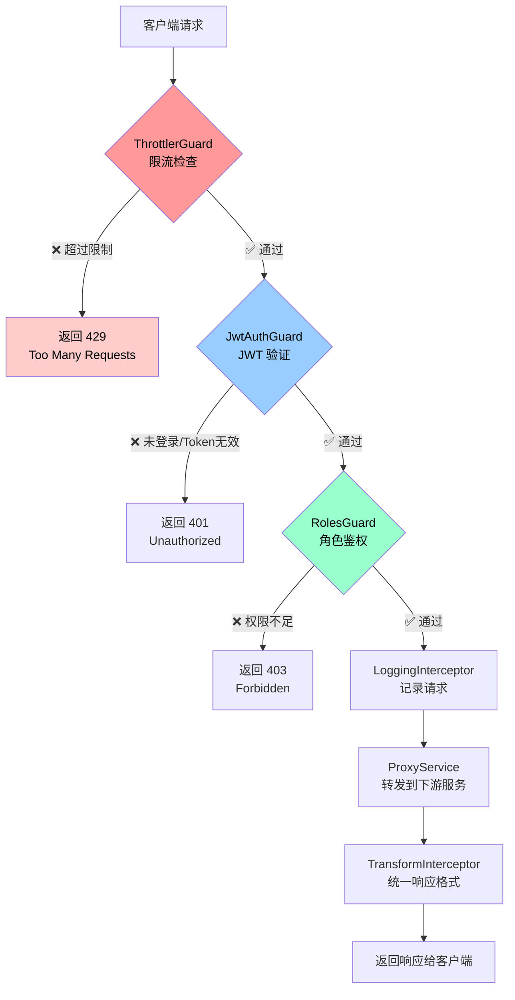

# Step 6 — 全局限流（Rate Limiting）

**日期：** 2026-04-20  
**目标：** 使用 `@nestjs/throttler` 在网关层实现全局请求限流，保护所有接口不被暴力刷请求；登录接口单独收紧，防止暴力破解。

---

## 一、为什么需要限流？🛡️

没有限流保护时，任何人都可以：

- 🔴 **暴力破解登录**：每秒发送数千次登录请求，穷举密码
- 🔴 **DDoS / CC 攻击**：大量请求打垮服务
- 🔴 **爬虫滥用**：无限制抓取接口数据

限流（Rate Limiting）的核心思想：**在单位时间内，同一来源（IP）的请求次数超过阈值，立即拒绝并返回 429**。

---

## 二、核心概念 📚

### 2.1 ThrottlerModule

`@nestjs/throttler` 提供的模块，用于全局注册限流配置：

```ts
ThrottlerModule.forRoot([
  {
    name: 'default',   // 策略名称（可自定义）
    ttl: 60000,        // 时间窗口，单位：毫秒（60000ms = 60s）
    limit: 100,        // 窗口内最多允许的请求次数
  },
])
```

> 💡 **ttl 的单位**：`@nestjs/throttler v5+` 中 ttl 单位从秒改为了**毫秒**，注意区分版本！

### 2.2 ThrottlerGuard

执行限流逻辑的守卫（Guard），通过 `APP_GUARD` 注册为全局守卫：

```ts
{ provide: APP_GUARD, useClass: ThrottlerGuard }
```

工作原理：
1. 读取请求的 IP 地址（`req.ip` 或 `X-Forwarded-For`）
2. 以 `IP + 路由` 为 key，在内存中维护请求计数
3. 超过 `limit` 则抛出 `ThrottlerException`（HTTP 429）

### 2.3 @Throttle() — 路由级覆盖

在 Controller 方法上单独设置限流策略，**覆盖全局配置**：

```ts
@Throttle({ default: { limit: 5, ttl: 60000 } })
@Post('login')
login() { ... }
```

### 2.4 @SkipThrottle() — 跳过限流

某些接口不需要限流（如内部健康检查）：

```ts
@SkipThrottle()
@Get('health')
health() { ... }
```

---

## 三、请求生命周期（含限流位置）🔄



---

## 四、Guard 执行顺序 & 原因 ⚡

```
┌─────────────────────────────────────────────────────────┐
│              NestJS APP_GUARD 执行顺序                    │
│                                                         │
│  请求进入                                                │
│     │                                                   │
│     ▼                                                   │
│  ① ThrottlerGuard   ← 【第一位】限流，按 IP 计数          │
│     │                                                   │
│     ▼                                                   │
│  ② JwtAuthGuard     ← 【第二位】JWT 验证                 │
│     │                                                   │
│     ▼                                                   │
│  ③ RolesGuard       ← 【第三位】角色权限                 │
│     │                                                   │
│     ▼                                                   │
│  Controller / Handler                                   │
└─────────────────────────────────────────────────────────┘
```

> ⚠️ **为什么 ThrottlerGuard 必须排第一？**
>
> NestJS 的 `APP_GUARD` 按**注册数组顺序**依次执行。
>
> 如果把 ThrottlerGuard 放在 JwtAuthGuard 之后，攻击者可以：
> - 先通过大量**无 Token 请求**绕过 JWT 验证（直接 401 返回）
> - 但这些请求**不会被计数**，等于没有限流保护
>
> 把限流放**第一位**，确保：**任何请求，不管有没有 Token，都会被计数**。

---

## 五、实现步骤 🛠️

### Step 1：安装依赖

```bash
pnpm add @nestjs/throttler
```

### Step 2：修改 `app.module.ts`

```ts
import { Module } from '@nestjs/common';
import { APP_GUARD } from '@nestjs/core';
import { ThrottlerGuard, ThrottlerModule } from '@nestjs/throttler'; // 新增
import { AppController } from './app.controller';
import { AppService } from './app.service';
import { AuthModule } from './auth/auth.module';
import { JwtAuthGuard } from './auth/jwt-auth.guard';
import { RolesGuard } from './auth/roles.guard';
import { ProxyModule } from './proxy/proxy.module';

@Module({
  imports: [
    // 新增：全局限流配置
    // ttl 单位是毫秒（v5+），60000ms = 60s
    // 全局策略：每个 IP 每分钟最多 100 次请求
    ThrottlerModule.forRoot([
      {
        name: 'default',
        ttl: 60000,
        limit: 100,
      },
    ]),
    AuthModule,
    ProxyModule,
  ],
  controllers: [AppController],
  providers: [
    AppService,
    // ⚡ 注意顺序：ThrottlerGuard 必须排在 JwtAuthGuard 之前
    // 原因：限流需要对所有请求生效，包括未登录的恶意请求
    { provide: APP_GUARD, useClass: ThrottlerGuard },   // ① 限流（新增）
    { provide: APP_GUARD, useClass: JwtAuthGuard },     // ② JWT 验证
    { provide: APP_GUARD, useClass: RolesGuard },       // ③ 角色鉴权
  ],
})
export class AppModule {}
```

### Step 3：修改 `auth.controller.ts` — 登录接口收紧

```ts
import { Body, Controller, HttpCode, HttpStatus, Post } from '@nestjs/common';
import { Throttle } from '@nestjs/throttler'; // 新增
import { AuthService } from './auth.service';
import { LoginDto } from './dto/login.dto';
import { Public } from './jwt-auth.guard';

@Controller('auth')
export class AuthController {
  constructor(private readonly authService: AuthService) {}

  /**
   * POST /auth/login
   * Body: { email, password }
   * Response: { access_token: "eyJ..." }
   *
   * 🔒 限流覆盖：登录接口是暴力破解的高危目标
   *    全局策略是 100次/分钟，这里单独收紧为 5次/分钟
   *    超过后返回 429，强制等待窗口重置（最多等 60s）
   */
  @Throttle({ default: { limit: 5, ttl: 60000 } }) // 新增：覆盖全局配置
  @Post('login')
  @Public()
  @HttpCode(HttpStatus.OK)
  login(@Body() dto: LoginDto) {
    return this.authService.login(dto);
  }
}
```

---

## 六、限流策略对比表 📊

| 接口 | 策略来源 | ttl | limit | 说明 |
|------|---------|-----|-------|------|
| `POST /auth/login` | 路由级 `@Throttle` 覆盖 | 60s | **5** | 防暴力破解 |
| `All /api/*` | 全局默认 | 60s | **100** | 正常业务接口 |
| `GET /` | 全局默认 | 60s | 100 | 健康检查（可加 `@SkipThrottle()`） |

---

## 七、429 响应格式说明 & Step 7 衔接 🔗

### 当前（Step 6）默认响应

触发限流后，`@nestjs/throttler` 默认返回：

```json
{
  "statusCode": 429,
  "message": "ThrottlerException: Too Many Requests"
}
```

同时响应头会包含：
```
Retry-After: 60          ← 多少秒后可以重试
X-RateLimit-Limit: 100   ← 窗口内最大次数
X-RateLimit-Remaining: 0 ← 剩余次数
X-RateLimit-Reset: ...   ← 窗口重置时间戳
```

### Step 7 之后（统一响应格式）

Step 7 会实现 `AllExceptionsFilter`，统一捕获所有异常，包括 `ThrottlerException`，转换为项目统一格式：

```json
{
  "code": 429,
  "message": "请求过于频繁，请稍后再试",
  "data": null
}
```

> 💡 **衔接说明**：Step 6 不需要手动处理 429 格式，等 Step 7 实现异常过滤器后会自动统一。这是 NestJS 分层职责的体现——限流守卫只负责"拦不拦"，响应格式由过滤器统一处理。

---

## 八、验证方式 ✅

### 8.1 验证全局限流（普通接口）

使用 shell 循环快速发送 101 次请求，第 101 次应收到 429：

```bash
# 先登录拿到 token
TOKEN=$(curl -s -X POST http://localhost:3010/auth/login \
  -H "Content-Type: application/json" \
  -d '{"email":"alice@test.com","password":"any"}' | jq -r '.access_token')

# 循环发送 105 次请求，观察何时触发 429
for i in $(seq 1 105); do
  STATUS=$(curl -s -o /dev/null -w "%{http_code}" \
    -H "Authorization: Bearer $TOKEN" \
    http://localhost:3010/api/users)
  echo "第 $i 次：HTTP $STATUS"
done
```

预期：前 100 次返回 `200`，第 101 次起返回 `429`。

### 8.2 验证登录接口收紧

```bash
# 连续发送 6 次登录请求，第 6 次应收到 429
for i in $(seq 1 6); do
  STATUS=$(curl -s -o /dev/null -w "%{http_code}" \
    -X POST http://localhost:3010/auth/login \
    -H "Content-Type: application/json" \
    -d '{"email":"alice@test.com","password":"any"}')
  echo "第 $i 次登录：HTTP $STATUS"
done
```

预期：前 5 次返回 `200`（或 `401`，因为账号不存在），第 6 次返回 `429`。

### 8.3 在 Insomnia 中验证

1. 快速连续点击发送 `POST /auth/login` 超过 5 次
2. 观察响应从 `200/401` 变为 `429`
3. 等待 60 秒后再次发送，应恢复正常

---

## 九、关键知识点总结 🧠

| 知识点 | 说明 |
|--------|------|
| `ThrottlerModule.forRoot()` | 全局注册，支持多策略数组 |
| `APP_GUARD` 执行顺序 | 按注册数组顺序依次执行，限流必须排第一 |
| `@Throttle()` | 路由级覆盖，优先级高于全局配置 |
| `@SkipThrottle()` | 跳过限流，适合内部健康检查等接口 |
| ttl 单位 | v5+ 为毫秒，v4 为秒，注意版本差异 |
| 限流 key | 默认为 `IP + 路由`，可自定义 `ThrottlerGuard` 覆盖 `getTracker()` |
| 存储后端 | 默认内存存储；生产环境可替换为 Redis（`@nestjs/throttler-storage-redis`） |

---

## 十、文件变更总览 📁

```
apps/gateway/src/
├── app.module.ts          ← 新增 ThrottlerModule.forRoot()，调整 Guard 顺序
└── auth/
    └── auth.controller.ts ← 登录方法加 @Throttle({ default: { limit: 5, ttl: 60000 } })
```

对应 Git 提交：
```
feat(step-6): 实现全局限流 @nestjs/throttler ThrottlerGuard
```
