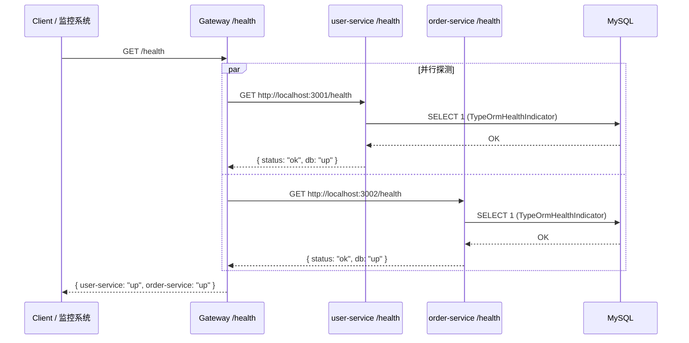

# 🗄️ libs/database — 共享数据库模块设计文档

> **日期**：2026-04-22  
> **目标**：将 TypeORM 数据库连接抽取到 `libs/database` 共享库，统一管理连接池配置，并封装健康检查 indicator，供 user-service / order-service 复用，最终通过 gateway 的 `/health` 接口统一暴露。

---

## 一、为什么要这样做？

### 🔴 改造前的痛点

```
apps/user-service/src/app.module.ts
  └── TypeOrmModule.forRootAsync(...)   ← 重复配置

apps/order-service/src/app.module.ts
  └── TypeOrmModule.forRootAsync(...)   ← 重复配置（几乎一模一样）
```

每次改连接池参数，要改两个地方；未来加 `product-service` 还要再改一次。

### ✅ 改造后的收益

```
libs/database/src/database.module.ts   ← 唯一的数据库配置入口

apps/user-service/src/app.module.ts    ← import DatabaseModule（一行）
apps/order-service/src/app.module.ts   ← import DatabaseModule（一行）
```

---

## 二、核心概念

### 2.1 NestJS Monorepo 的 `libs/` 机制

```
项目根目录/
├── apps/          ← 可独立运行的应用（有 main.ts）
└── libs/          ← 不能独立运行，只能被 apps/ 导入的共享库
```

`libs/` 里的模块会被注册为 TypeScript 路径别名（`@app/xxx`），
任何 app 都可以用 `import { DatabaseModule } from '@app/database'` 导入，
就像导入 `@nestjs/common` 一样自然。

### 2.2 `autoLoadEntities: true` — 为什么关键

**不用 autoLoadEntities：**
```ts
// DatabaseModule 需要知道所有 entity，导致耦合
TypeOrmModule.forRootAsync({
  useFactory: () => ({
    entities: [User, Order],  // ← 每次加新 entity 都要改这里！
  }),
})
```

**用 autoLoadEntities：**
```ts
// DatabaseModule 完全不知道 entity 是谁
TypeOrmModule.forRootAsync({
  useFactory: () => ({
    autoLoadEntities: true,  // ← 自动收集所有 forFeature 注册的 entity
  }),
})

// 各服务自己管理自己的 entity
@Module({
  imports: [TypeOrmModule.forFeature([User])]  // ← 注册时自动告知根连接
})
```

原理：`TypeOrmModule.forFeature([Entity])` 注册时会把 entity 推送给根连接的 `entityMetadataMap`，根连接用 `autoLoadEntities` 监听这个过程。

### 2.3 连接池参数

| 参数 | 说明 | 默认值 | 推荐值（学习环境） |
|------|------|--------|-----------------|
| `extra.connectionLimit` | 连接池最大连接数 | 10 | 5~10 |
| `connectTimeout` | 连接超时（ms） | 10000 | 10000 |
| `acquireTimeout` | 从池中获取连接的超时（ms） | 10000 | 10000 |

> ⚠️ TypeORM 使用 mysql2 驱动，连接池参数放在 `extra` 字段里：
> ```ts
> extra: { connectionLimit: 10 }
> ```

### 2.4 `@nestjs/terminus` 健康检查

```
┌──────────────────────────────────────────────┐
│  TypeOrmHealthIndicator                       │
│                                               │
│  pingCheck('database')                        │
│  └── 执行 SELECT 1 探测数据库是否存活          │
│      ├── 成功 → { status: 'up' }              │
│      └── 失败 → { status: 'down', error: ... }│
└──────────────────────────────────────────────┘
```

`DatabaseModule` 导出这个 indicator，各服务的 `HealthController` 注入后
挂在自己的 `/health` 路由上，供 gateway 聚合调用。

---

## 三、请求生命周期（健康检查）



---

## 四、目录结构设计

```
libs/
└── database/
    ├── src/
    │   ├── database.module.ts      ← TypeOrmModule.forRootAsync 封装
    │   ├── database.health.ts      ← DatabaseHealthModule（封装 TypeOrmHealthIndicator）
    │   └── index.ts                ← 统一导出入口
    └── tsconfig.lib.json           ← lib 专属 ts 配置（继承根 tsconfig）

apps/
├── user-service/
│   ├── src/
│   │   ├── health/
│   │   │   └── health.controller.ts   ← GET /health
│   │   └── app.module.ts              ← import DatabaseModule（替换原有 TypeOrmModule）
│   └── .env                           ← 数据库连接 + 连接池变量
│
├── order-service/
│   ├── src/
│   │   ├── health/
│   │   │   └── health.controller.ts   ← GET /health
│   │   └── app.module.ts              ← import DatabaseModule（替换原有 TypeOrmModule）
│   └── .env                           ← 数据库连接 + 连接池变量
│
└── gateway/
    └── src/
        └── proxy/proxy-routes.config.ts  ← 添加 /health 路由转发规则（可选）
```

---

## 五、环境变量设计

采用「**根目录 `.env` + 服务级覆盖**」策略：

```
项目根目录/
├── .env                         ← 公共变量（host/port/username/password/pool）
├── .env.example                 ← 公共变量模板（可提交 git）
├── apps/
│   ├── user-service/
│   │   ├── .env                 ← 覆盖：DB_DATABASE=nest_user_service
│   │   └── .env.example
│   └── order-service/
│       ├── .env                 ← 覆盖：DB_DATABASE=nest_order_service
│       └── .env.example
```

### 根目录 `.env`（公共）

```dotenv
# ── 数据库连接（公共）────────────────────────
DB_HOST=localhost
DB_PORT=3306
DB_USERNAME=root
DB_PASSWORD=

# ── 连接池 ───────────────────────────────────
DB_POOL_SIZE=10                 # 最大连接数
DB_CONNECT_TIMEOUT=10000        # 连接超时（ms）

# ── 开发选项 ─────────────────────────────────
DB_SYNCHRONIZE=true             # 生产环境必须改为 false，改用 migration
```

### `apps/user-service/.env`（服务级覆盖）

```dotenv
DB_DATABASE=nest_user_service
```

### `apps/order-service/.env`（服务级覆盖）

```dotenv
DB_DATABASE=nest_order_service
```

### ConfigModule 多文件加载（优先级规则）

```ts
ConfigModule.forRoot({
  // 数组中靠前的文件优先级更高，后面的作为兜底
  // 服务级 .env 先读，根目录 .env 补充剩余变量
  envFilePath: [
    'apps/user-service/.env',   // ① 先读：DB_DATABASE（服务特有）
    '.env',                     // ② 兜底：DB_HOST / DB_PORT / DB_USERNAME / 连接池等
  ],
  isGlobal: true,
})
```

> 📌 所有 `.env` 文件加入 `.gitignore`，只提交对应的 `.env.example`

---

## 六、配置文件改动

### 6.1 `nest-cli.json` — 注册 database lib

```json
{
  "$schema": "https://json.schemastore.org/nest-cli",
  "monorepo": true,
  "root": "apps/gateway",
  "sourceRoot": "apps/gateway/src",
  "compilerOptions": { ... },
  "projects": {
    "gateway": { ... },
    "user-service": { ... },
    "order-service": { ... },

    // ✅ 新增：注册 database lib
    "database": {
      "type": "library",
      "root": "libs/database",
      "entryFile": "index",
      "sourceRoot": "libs/database/src",
      "compilerOptions": {
        "tsConfigPath": "libs/database/tsconfig.lib.json"
      }
    }
  }
}
```

### 6.2 `tsconfig.json` — 添加路径别名

```json
{
  "compilerOptions": {
    "paths": {
      "@app/common": ["libs/common/src"],
      "@app/common/*": ["libs/common/src/*"],

      // ✅ 新增：database lib 路径别名
      "@app/database": ["libs/database/src"],
      "@app/database/*": ["libs/database/src/*"]
    }
  }
}
```

---

## 七、实现代码

### 7.1 `libs/database/src/database.module.ts`

```ts
import { Module } from '@nestjs/common';
import { ConfigModule, ConfigService } from '@nestjs/config';
import { TypeOrmModule } from '@nestjs/typeorm';

@Module({
  imports: [
    TypeOrmModule.forRootAsync({
      // ConfigModule 已在各服务 app.module.ts 里以 isGlobal: true 注册，
      // 这里 imports 是为了让 forRootAsync 的依赖注入能找到 ConfigService
      imports: [ConfigModule],
      inject: [ConfigService],
      useFactory: (config: ConfigService) => ({
        type: 'mysql',
        host:     config.get<string>('DB_HOST', 'localhost'),
        port:     config.get<number>('DB_PORT', 3306),
        username: config.get<string>('DB_USERNAME', 'root'),
        password: config.get<string>('DB_PASSWORD', ''),
        database: config.get<string>('DB_DATABASE', 'nest_shared_db'),

        // ✅ 关键：不在这里写死 entities，各服务用 forFeature 注册
        autoLoadEntities: true,

        // 生产环境必须为 false，改用 TypeORM migration 管理表结构变更
        synchronize: config.get<string>('DB_SYNCHRONIZE', 'false') === 'true',

        // 连接池配置（mysql2 驱动的 extra 字段）
        extra: {
          connectionLimit: config.get<number>('DB_POOL_SIZE', 10),
          connectTimeout:  config.get<number>('DB_CONNECT_TIMEOUT', 10000),
        },
      }),
    }),
  ],
  // 不需要 exports：TypeOrmModule.forRootAsync 的连接会自动注册为全局 DataSource
})
export class DatabaseModule {}
```

> 💡 **为什么不用 `exports`？**
> `TypeOrmModule.forRootAsync` 创建的是全局 `DataSource` 连接，
> NestJS 会自动将它注册为全局 token，`forFeature` 可以在任意模块中使用，
> 无需显式 export。

### 7.2 `libs/database/src/database.health.ts`

```ts
import { Module } from '@nestjs/common';
import { TerminusModule } from '@nestjs/terminus';
import { TypeOrmHealthIndicator } from '@nestjs/terminus';

/**
 * DatabaseHealthModule
 *
 * 封装 TypeOrmHealthIndicator，供各服务的 HealthController 注入使用。
 * 导出 TypeOrmHealthIndicator 使其可被导入此模块的服务注入。
 *
 * 使用方式：
 *   @Module({ imports: [DatabaseHealthModule] })
 *   export class AppModule {}
 *
 *   @Controller('health')
 *   export class HealthController {
 *     constructor(
 *       private health: HealthCheckService,
 *       private db: TypeOrmHealthIndicator,
 *     ) {}
 *
 *     @Get()
 *     check() {
 *       return this.health.check([
 *         () => this.db.pingCheck('database'),
 *       ]);
 *     }
 *   }
 */
@Module({
  imports: [TerminusModule],
  exports: [TerminusModule, TypeOrmHealthIndicator],
})
export class DatabaseHealthModule {}
```

### 7.3 `libs/database/src/index.ts` — 统一导出

```ts
export { DatabaseModule } from './database.module';
export { DatabaseHealthModule } from './database.health';
```

### 7.4 `libs/database/tsconfig.lib.json`

```json
{
  "extends": "../../tsconfig.json",
  "compilerOptions": {
    "declaration": true,
    "outDir": "../../dist/libs/database"
  },
  "include": ["src/**/*"],
  "exclude": ["node_modules", "dist", "test", "**/*spec.ts"]
}
```

### 7.5 改造后的 `apps/user-service/src/app.module.ts`

```ts
import { Module } from '@nestjs/common';
import { ConfigModule } from '@nestjs/config';
import { DatabaseModule, DatabaseHealthModule } from '@app/database';
import { UsersModule } from './users/users.module';
import { HealthController } from './health/health.controller';

@Module({
  imports: [
    // ① 读取 .env，isGlobal 使 ConfigService 全局可用（DatabaseModule 里也能注入）
    ConfigModule.forRoot({
      envFilePath: 'apps/user-service/.env',
      isGlobal: true,
    }),

    // ② 数据库连接（来自共享 lib，一行搞定）
    DatabaseModule,

    // ③ 健康检查所需的 TerminusModule + TypeOrmHealthIndicator
    DatabaseHealthModule,

    // ④ 业务模块
    UsersModule,
  ],
  controllers: [HealthController],
})
export class AppModule {}
```

### 7.6 `apps/user-service/src/health/health.controller.ts`

```ts
import { Controller, Get } from '@nestjs/common';
import { HealthCheck, HealthCheckService, TypeOrmHealthIndicator } from '@nestjs/terminus';

/**
 * GET /health
 *
 * 响应示例（正常）：
 * {
 *   "status": "ok",
 *   "info": { "database": { "status": "up" } },
 *   "error": {},
 *   "details": { "database": { "status": "up" } }
 * }
 *
 * 响应示例（数据库宕机）：
 * {
 *   "status": "error",
 *   "info": {},
 *   "error": { "database": { "status": "down", "message": "..." } },
 *   "details": { "database": { "status": "down" } }
 * }
 */
@Controller('health')
export class HealthController {
  constructor(
    private readonly health: HealthCheckService,
    private readonly db: TypeOrmHealthIndicator,
  ) {}

  @Get()
  @HealthCheck()
  check() {
    return this.health.check([
      // pingCheck 内部执行 SELECT 1 探测数据库连通性
      () => this.db.pingCheck('database'),
    ]);
  }
}
```

> `order-service` 的 `health.controller.ts` 与此完全一致，仅 `envFilePath` 不同。

---

## 八、为什么 Gateway 不连数据库？

```
Gateway 的职责：路由转发、认证、限流、日志
  ↓ 不做业务，不操作数据库
  ↓ 健康检查通过代理转发实现，不需要直接连 DB

Gateway /health 实现方式（proxy-routes.config.ts 里添加）：
  /health/user   → http://localhost:3001/health
  /health/order  → http://localhost:3002/health
```

所以 `gateway` 的 `app.module.ts` **不需要** import `DatabaseModule`。

---

## 九、实现步骤汇总

> 等你说「开始执行」后按此顺序操作

| 步骤 | 操作 | 涉及文件 |
|------|------|---------|
| 1 | 安装 `@nestjs/terminus` | `package.json` |
| 2 | 注册 lib 到 nest-cli | `nest-cli.json` |
| 3 | 添加路径别名 | `tsconfig.json` |
| 4 | 创建 lib 文件 | `libs/database/src/` |
| 5 | 改造 user-service | `app.module.ts` + `health.controller.ts` + `.env` |
| 6 | 改造 order-service | `app.module.ts` + `health.controller.ts` + `.env` |
| 7 | 编译验证 | `npx nest build user-service && npx nest build order-service` |
| 8 | 更新 gateway 路由（可选）| `proxy-routes.config.ts` |

---

## 十、知识点总结

| 概念 | 要点 |
|------|------|
| `libs/` vs `apps/` | libs 不能独立运行，只能被 import；apps 有 main.ts 可独立启动 |
| `autoLoadEntities` | 让 `forFeature` 注册的 entity 自动加入根连接，避免 entity 耦合 |
| 连接池 `extra` | mysql2 驱动的连接池参数在 `extra` 字段，不是顶层 |
| `@nestjs/terminus` | 提供 `HealthCheckService` + 各种 indicator，标准健康检查方案 |
| `isGlobal: true` | ConfigModule 设置后，所有模块（包括 libs）都能注入 ConfigService |
| `.env` 文件路径 | NestJS 的 `envFilePath` 是相对于**项目根目录**（CWD），不是相对于模块文件 |

---

## 十一、验证方式

```bash
# 启动 user-service
npx nest start user-service

# 另一个终端测试健康检查
curl http://localhost:3001/health

# 预期响应
{
  "status": "ok",
  "info": { "database": { "status": "up" } },
  "error": {},
  "details": { "database": { "status": "up" } }
}
```
